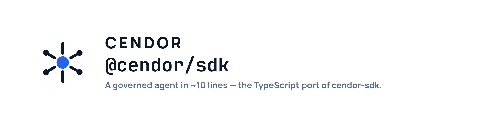

<p align="center">
  <picture>
    <source media="(prefers-color-scheme: dark)" srcset=".github/assets/cendor-sdk-js-banner-dark.png">
    
  </picture>
</p>

**A governed agent in ~10 lines — cost budgets, tamper-evident audit, and PII redaction built in.**

A thin, model-agnostic agent SDK where governance is the *foundation*, not a plugin. The TypeScript/JavaScript port of [`cendor-sdk`](https://github.com/cendorhq/cendor-sdk).

[](https://www.npmjs.com/package/@cendor/sdk)     [](https://biomejs.dev) [](https://github.com/cendorhq/cendor-sdk-js/actions/workflows/ci.yml)

<!-- cendor:downloads:start — self-hosted badges from cendor.ai (no third party in the render path).
     The numbers live inside the SVGs, regenerated daily from the committed ledger, so this file
     never goes stale. PyPI excludes index mirrors; npm publishes no mirror filter, which is why the
     two are shown separately and never summed. Method: https://cendor.ai/downloads -->
[](https://cendor.ai/downloads) [](https://cendor.ai/downloads) [](https://cendor.ai/downloads)
<!-- cendor:downloads:end -->

[**Install**](#install) · [**Governed in 10 lines**](#a-governed-agent-in-10-lines) · [**Why different**](#why-its-different) · [**Providers**](#every-major-provider--one-canonical-loop) · [**Docs**](https://cendor.ai/docs/sdk/getting-started)

*model-agnostic · ESM-only · local-first · offline by default*

Using an AI coding assistant? `npx @cendor/init` (TS) / `uvx cendor-init` (Python) wires it up — or point it at [cendor.ai/docs/for-ai-assistants](https://cendor.ai/docs/for-ai-assistants).

> **The second door into [Cendor](https://github.com/cendorhq/cendor-libs).** One brand, two doors:
> compose the [seven libraries](https://github.com/cendorhq/cendor-libs-js) beneath *your* framework, or
> take the whole loop — governed — with this SDK. The `budget` / `guard` / `AuditLog` / … you import
> here are the **real** `@cendor/*` library objects, re-exported for one-import convenience — and
> since 0.10.0 that is CI-verified: an identity test suite pins every re-export
> (`Object.is(sdk.guard, acttrace.guard)`), the `rules` namespace carries the full library catalogue
> (spotlight + the detection-tier adapters included), and `embed()` is governed pre-flight.

---

## The problem

Governance is best-effort *beneath* a framework — the framework owns the loop, so budgets, audit,
and redaction only ever see what leaks out to a callback. `cendor-sdk` **owns the agent loop**, so
every concern that's fragile beneath a framework becomes first-class here:

- 💸 **Usage is never lost** — every model and tool call flows through one seam, priced in exact `Money`.
- 🚦 **Budgets enforce *before* the call** — an over-budget run is refused, not just reported after it billed.
- 🔒 **PII is redacted *before* send** — the provider never sees it.
- 📋 **The whole run is one tamper-evident chain** — every step correlated under a single `traceId`, `verify()`-able offline.
- 🧪 **Runs replay in tests** — record once, replay forever: offline, deterministic, free.

You don't need to pick a framework or wire the libraries together. (Already have a framework?
Compose the libraries beneath it: `npm i @cendor/libs`.)

## Install

```bash
npm i @cendor/sdk openai            # + the provider SDK(s) you call
npm i @anthropic-ai/sdk @google/genai ollama   # e.g. Anthropic / Gemini / Ollama
```

The install bundles the whole Cendor stack (`@cendor/core`, `tokenguard`, `guardrails`, `acttrace`,
`contextkit`, `squeeze`, `cassette` — all seven) as dependencies — you install once and import only
from `@cendor/sdk`.
Provider SDKs, `@opentelemetry/api`, and `@modelcontextprotocol/sdk` stay **optional peers**;
`better-sqlite3` (durable sessions/audit) is an optional dependency. ESM-only, ships its own types.

## A governed agent in 10 lines

**Auth:** `new OpenAI()` reads `OPENAI_API_KEY` from your environment — or pass `apiKey` on the
`Agent`, or drop the `client` and let the SDK build it. There's no Cendor-specific key. Full table:
[Keys & providers →](https://cendor.ai/docs/sdk/providers#api-keys--credentials).

```ts
import OpenAI from 'openai';
import { Agent, run, tool, withBudget, guard, Policy, AuditLog } from '@cendor/sdk';
import { z } from 'zod';

const getWeather = tool((a: { city: string }) => `Sunny in ${a.city}`, {
  name: 'get_weather',
  description: 'Current weather for a city',
  parameters: z.object({ city: z.string() }),
});

const agent = new Agent({ name: 'assistant', model: 'gpt-4o', tools: [getWeather], client: new OpenAI() });

const log = new AuditLog('support', { riskTier: 'limited', path: 'audit.jsonl' });
const result = await withBudget({ usd: 0.25, onExceed: 'block' }, () =>   // refused if the call would exceed
  guard({ policy: Policy.default(), audit: log }, () =>                   // redact PII before send
    run(agent, "What's the weather in Paris?", { audit: log })));

console.log(result.output);                          // → "It's sunny in Paris."
console.log(result.cost.toString(), result.usage);   // priced in decimal, budgeted
console.log(result.toolSteps.map((s) => s.name));    // → ["get_weather"]
// audit.jsonl: audit_open → decision → llm_call → tool_call → llm_call, hash-chained & verify()-able,
// all correlated by one traceId. Wrap in `using("run.json", …)` to replay it in a test.
```

**Ungoverned still works — on `@cendor/core` alone.** Every governance layer is optional and
removable; drop the wrappers and `run(agent, …)` runs bare:

```ts
import { Agent, run } from '@cendor/sdk';
const result = await run(new Agent({ name: 'a', model: 'gpt-4o', instructions: 'Be brief.' }), 'Hi');
```

## Why it's different

| | Provider lock | Cost budgets | Tamper-evident audit | PII redaction | Record/replay tests | Local-first |
|---|---|---|---|---|---|---|
| OpenAI Agents SDK (JS) | OpenAI-centric | ✗ | ✗ | ✗ | ✗ | lib |
| Vercel AI SDK | agnostic | DIY | DIY | DIY | DIY | lib |
| LangGraph.js | agnostic | DIY | DIY | DIY | DIY | lib |
| **@cendor/sdk** | **agnostic** | **built-in** | **built-in** | **built-in** | **built-in** | **yes** |

Governance is composed through Cendor's existing **bus / interceptor / `Sink` / `Compressor`** seams,
correlated by `trace()` — **zero SDK-specific glue**. A bare `run()` needs only `@cendor/core`; every
layer (`budget`, `guard`, `audit`, cassette replay) is one wrapper you can add or remove, because
removing it is just not entering its scope.

## Multi-agent, one correlated tree

Handoff, supervisor/router, and sequential/parallel pipelines — with the correlation that was
*impossible beneath frameworks*. A whole multi-agent run is one governed, `traceId`-correlated tree
on one verifiable audit chain. Handoff even works **across providers**:

```ts
import { Agent, run } from '@cendor/sdk';

const writer  = new Agent({ name: 'writer',  model: 'claude-opus-4-8', instructions: 'Write the brief.' });
const planner = new Agent({ name: 'planner', model: 'gpt-4o', instructions: 'Plan, then hand off.',
                            handoffs: ['writer'] });

const result = await run([planner, writer], 'Research X and write a brief');   // OpenAI → Anthropic handoff
console.log(result.agents);   // ['planner', 'writer']
```

`sequential` (pipe each output into the next), `parallel` / `parallelAsync` (fan-out), and
`supervisor(coordinator, agents, …)` (router) round out the shapes. `Agent({ maxUsd })` caps a single
agent's segment inside the run.

## Every major provider — one canonical loop

The provider is inferred from the model id (override with `provider`). History is held in one
canonical shape, so a run can **hand off between providers** without rewriting it.

| Provider | Models | SDK |
|---|---|---|
| **OpenAI** | Chat Completions + Responses API | `openai` |
| **Anthropic** | Messages API | `@anthropic-ai/sdk` |
| **Google Gemini** | `google-genai` | `@google/genai` |
| **AWS Bedrock** | Converse API | `@aws-sdk/client-bedrock-runtime` |
| **Ollama** | local models | `ollama` |
| **Hugging Face** | Inference / endpoints | `@huggingface/inference` |
| **Azure AI Foundry** | deployments via the OpenAI v1 endpoint (Chat + Responses) | `openai` |
| **Foundry Local** | on-device, OpenAI-compatible | `openai` |

> **Azure keyless auth:** pass `azureADTokenProvider` (an async `() => Promise<string>` token callback)
> on the agent or client options instead of an API key to authenticate against Azure AI Foundry with
> Microsoft Entra ID — the token is refreshed per request.

> **Automatic token/cost capture is live for every provider** — OpenAI (Chat + Responses),
> Anthropic, Gemini, Bedrock, Ollama, Hugging Face, Azure AI Foundry (Chat + Responses), and Foundry
> Local. The installed `@cendor/core`'s `instrument()` detects each client and records usage/cost on
> the bus (Hugging Face / Ollama / Gemini / Bedrock-converse shipped in `@cendor/core` 0.3.0; this
> package pins the current line — that release is from core's pre-1.0 series, not the `3.x` line you
> install today). Source of truth: the [parity matrix](https://cendor.ai/docs/languages).

## More in the box

Everything a real agent needs — all governed through the same seams.

**Streaming** — `run.stream` / `run.astream` are async generators of live text + tool events:

```ts
for await (const ev of run.stream(agent, 'Write a haiku about tokens')) {
  if (ev.type === 'text_delta') process.stdout.write(ev.text);
  else if (ev.type === 'run_complete') console.log('\ncost:', ev.result.cost.toString());
}
```

**Structured output** — a zod schema (or a raw JSON schema) as `outputType` uses each provider's
native schema mode and hands back a parsed, typed object:

```ts
import { z } from 'zod';
const extractor = new Agent({ name: 'extractor', model: 'gpt-4o',
  outputType: z.object({ sentiment: z.enum(['pos', 'neg']), score: z.number() }) });
const { output } = await run(extractor, 'I love this');   // → { sentiment: 'pos', score: … }
```

**Memory** — `Session` (conversation), `SummarizingSession` (rolling summary via `llmSummarizer`),
`SqliteSessionStore` / `MemorySessionStore` (durable, multi-conversation):

```ts
import { run, Session, SqliteSessionStore } from '@cendor/sdk';
const store = new SqliteSessionStore('sessions.db');
const session = store.load('user-42');
await run(agent, 'Remember my name is Dana.', { session });
store.save('user-42', session);
```

**RAG** — `VectorIndex` + `Agent({ retriever })` inject governed retrieval automatically; `embed()` /
`aembed()` capture embedding calls on the same cost/audit tree:

```ts
import OpenAI from 'openai';
import { Agent, run, VectorIndex } from '@cendor/sdk';
const index = new VectorIndex({ client: new OpenAI() });
await index.add(['Refunds are processed in 5–7 days.', 'We ship to the EU.']);
const support = new Agent({ name: 'support', model: 'gpt-4o', retriever: index.asRetriever(3) });
await run(support, 'How long do refunds take?');   // retrieved context injected before the turn
```

- **Cost governance for any model** — `registerModelPrice('my-deployment', { input: 2.5, output: 10 })` (USD per 1M tokens) so budgets bind on custom / deployment-named ids.
- **Attribution & assertions** — `track({ feature, userId }, …)` and `report(['feature']).assertUnder(0.05, …)`.
- **Production hardening** — `RetryPolicy` + `run(agent, input, { retry })`; checkpoint/resume with `run(agent, input, { checkpoint: 'run.ckpt.json' })` so a crashed run resumes.
- **Interop** — `loadMcpTools(...)` (MCP tools/prompts/resources), `A2AServer` / `A2AClient` / `serve` (Agent-to-Agent), `FoundryAdapter` (Bot Framework / Copilot), live OTel spans via `spanTree` / `liveSpans`.
- **Governed eval** — `evaluate(...)` replays cassette-backed trajectories as CI tests — behaviour *and* spend.
- **Human-in-the-loop** — `requireApproval(...)` records approvals on the same audit chain the run is correlated by.
- **Full agent-loop surface** — live progress hooks (`run(agent, input, { onStep })`), Anthropic prompt caching (`Agent({ cache: true })`), multi-agent streaming with streamed checkpoints, bounded re-ask on an output trip (`Agent({ reaskOnOutputTrip })`), partial-output stream checks (`Agent({ streamCheckWindow })`), and `result.conversationId` auto-stamped from a keyed session.
- **OpenTelemetry** — post-hoc `spanTree(result)` and live `liveSpans()`, with six first-class `cendor.sdk` telemetry domains on the live path (RAG · memory · orchestration · checkpoints · tools · MCP) that a backend (or Cendor Monitor) renders per domain.

## Design principles

1. **Cooperate through core.** The SDK adds no governance machinery of its own — it depends on all seven libraries (see [Install](#install)) and each one attaches through `@cendor/core`'s bus and interceptor seams. No tool imports another, and nothing patches anything.
2. **Governed by default, escapable.** Each layer is one wrapper or one option; removing it never breaks the loop.
3. **Local-first, no servers.** Sessions, checkpoints, audit chains, and cassettes are local files. Cloud and OpenTelemetry export are opt-in.
4. **Same API in both languages.** `snake_case` ↔ `camelCase`, identical defaults and error names — see the [parity matrix](https://cendor.ai/docs/languages). Faithful to the Python SDK's surface.

## Scope & honest limits

- **A streamed call's token count can be an estimate.** Capture is live for every provider in the [table above](#every-major-provider--one-canonical-loop), but when a provider reports no usage on the stream, `@cendor/core` recovers the count offline and flags it (`cendor.usage_estimated`) rather than passing a guess off as measured. Non-streamed calls use the provider's reported figures.
- **`onExceed: 'raise'` overshoots by one call** — it's post-flight. For a true ceiling use `'block'`.
- **Unpriced models record `$0`,** so a USD cap can't bind on them — `registerModelPrice(...)` or use a token cap.
- **`guard` / interceptors are process-global** — they register on the single in-process bus, so install policy once at startup rather than toggling per request.
- **PII redaction is regex/pattern-based** in JS (no Presidio NER — that's Python-only). See the [parity matrix](https://cendor.ai/docs/languages).
- **Evidence, not compliance.** The audit chain supports a compliance case; it doesn't make one, and it isn't legal advice.

## Docs & examples

The shared, searchable docs site (with a page-wide Python / TypeScript toggle):

- [Getting started](https://cendor.ai/docs/sdk/getting-started) — install, a first governed agent, where each concept lives
- [Agents & the loop](https://cendor.ai/docs/sdk/agents) · [Governance](https://cendor.ai/docs/sdk/governance) · [Memory](https://cendor.ai/docs/sdk/memory) · [RAG](https://cendor.ai/docs/sdk/rag)
- [Multi-agent](https://cendor.ai/docs/sdk/multi-agent) · [Providers](https://cendor.ai/docs/sdk/providers) · [Interop](https://cendor.ai/docs/sdk/interop) · [Hardening](https://cendor.ai/docs/sdk/hardening) · [Eval](https://cendor.ai/docs/sdk/eval)
- [FAQ](https://cendor.ai/docs/sdk/faq) — including "libraries or SDK?"

## Develop

A pnpm workspace with two published packages: [`packages/sdk`](packages/sdk) (`@cendor/sdk`) and
[`packages/init`](packages/init) (`@cendor/init`, the offline `init` / `doctor` CLI — optional dev
tooling nothing depends on at runtime).

```bash
pnpm install
pnpm build       # tsc -b
pnpm test        # vitest — no network (real openai/@anthropic-ai SDKs against undici MockAgent + stub clients)
pnpm typecheck
pnpm lint        # biome
pnpm check:docs  # typecheck every ```ts block in the docs trees against the built packages
```

`pnpm check:docs` extracts every TypeScript snippet from both docs trees and typechecks it against
the real packages, so a breaking API change fails before release. Releases are driven by
[changesets](https://github.com/changesets/changesets) — see [`PUBLISHING.md`](PUBLISHING.md), where
publishing is gated on the same checks CI runs. Publish with `pnpm publish` (rewrites `workspace:^`
ranges), never `npm publish`.

Contributions welcome — [`CONTRIBUTING.md`](CONTRIBUTING.md) has the setup and the exact gates to run
before a PR, and [`CODE_OF_CONDUCT.md`](CODE_OF_CONDUCT.md) applies. Found a security problem? Please
don't open a public issue — see [`SECURITY.md`](SECURITY.md).

## License & disclaimer

Licensed under the **Apache License 2.0** — see [`LICENSE`](LICENSE) and [`NOTICE`](NOTICE).
Copyright 2026 Raghav Mishra (PowerAI Labs).

> **No warranty — use at your own risk.** This software is provided on an **"AS IS" BASIS, WITHOUT
> WARRANTIES OR CONDITIONS OF ANY KIND**, and the authors and contributors carry **no liability** for
> any damages, losses, or business impact arising from its use or inability to use it — see Apache-2.0
> **§7 (Disclaimer of Warranty)** and **§8 (Limitation of Liability)** in [`LICENSE`](LICENSE). You are
> solely responsible for determining suitability and assume all risk. (`acttrace` in particular
> produces *evidence to support* compliance — not a guarantee, and not legal advice.)

---
*An open-source project by [PowerAI Labs](https://powerailabs.dev). Apache-2.0 licensed.*
